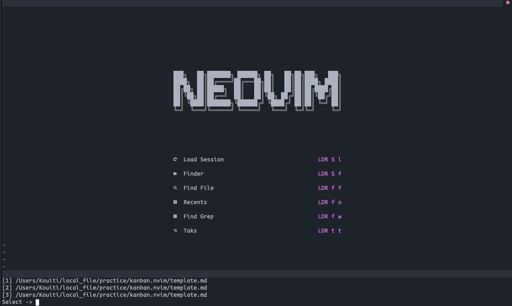
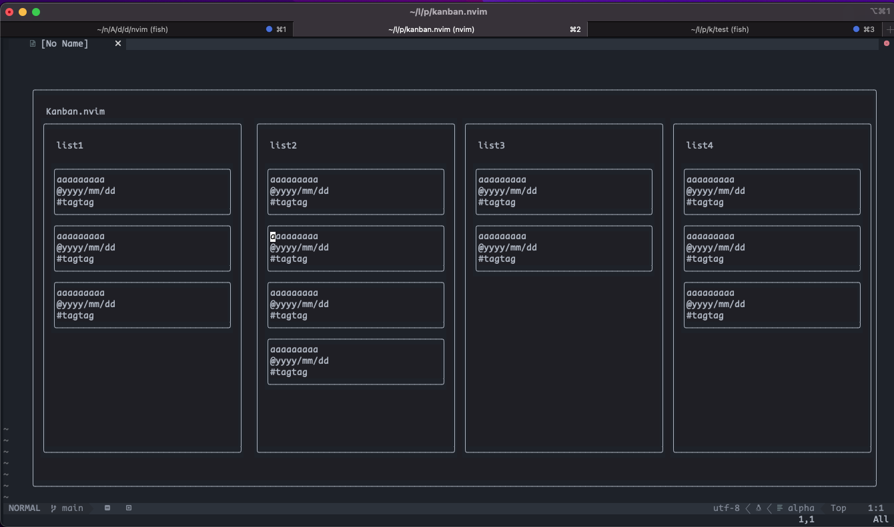

# kanban.nvim
> This is a project in development, if you have any requests, please add them to the issue
Neovim kanban plugin.
Manage task as a kanban boad in neovim.
Task information is import and export by markdown file.
Compatible with obsidian kanban.

## screenshots



## Instration
using packer
```
use  'arakkkkk/kanban.nvim'

require('kanban').setup({})
```

## Setup
```
# default settings
require("kanban").setup({
  layout = {
		x_margin = 5,
		y_margin = 3,
		task_height = 3,
  },
  markdown = {
		list_head = "## ",
		title_head = "- [ ] ",
		title_style = "[[<title>]]",
		due_head = "@",
		due_style = "{<due>}",
		tag_head =  "#",
		tag_style = "<tag>",
		header = {
			"---",
			"",
			"kanban-plugin: basic",
			"",
			"---",
		},
		footer = {},
  },
  move_position = {
    "top"           -- "top" or "botom"
  },
  kanban_md_path = {
    "/path/to/kanban/markdown/path.md",
    "/path/to/kanban/markdown/path.md",
    "/path/to/kanban/markdown/path.md",
  }
})
```

