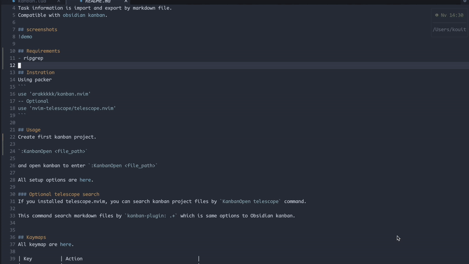

# kanban.nvim
Neovim kanban plugin.
Manage task as a kanban board in neovim.
Task information is import and export by markdown file.
Compatible with [obsidian kanban](https://github.com/mgmeyers/obsidian-kanban).

## screenshots


## Requirements
- ripgrep

## Installation
Using packer
```lua
use 'arakkkkk/kanban.nvim'
-- Optional
use 'nvim-telescope/telescope.nvim'
```
and setup
```lua
require("kanban").setup({
	markdown = {
		description_folder = "./tasks/",  -- Path to save the file corresponding to the task.
		list_head = "## ",
	}
})
```
Using lazy.nvim
```lua
return {
  "arakkkkk/kanban.nvim",
  -- Optional
  dependencies = {
    "nvim-telescope/telescope.nvim",
  },

  config = function()
    require("kanban").setup({
      markdown = {
        description_folder = "./tasks/", -- Path to save the file corresponding to the task.
        list_head = "## ",
      },
    })
  end,
}
```

With the above settings, you can manage tasks as follows

```
.
└── kanban.md
    └── tasks           # Configured by setup option (description_folder)
        ├── task1.md    # Memo for task1
        ├── task2.md    # Memo for task2
        ├── task3.md    # Memo for task3
        └── task4.md    # Memo for task4
```

## Usage
Create first kanban project.

`:KanbanCreate <file_path>`

and open kanban to enter `:KanbanOpen <file_path>`.

You can add new tasks with `a` and move cards to focus with `<C-h/j/k/l>`.

You can also move a card with `H/J/K/L`.

See more keymap for information on how to create and move tasks.

In a task card, the first line of text is as the task title, the string beginning with `@` is treated as the deadline, and the characters beginning with `#` are treated as tags.

All setup options are [here](./lua/kanban/ops.lua).

## Format of task cards

- First line is **Task title**.
- Line beginning with `#` are **tag**.
- Line beginning with `@` is **due**.

## Integration
### Obsidian.nvim

If you are an obsidian.nvim user, you can use this plugin as an Obsidian command.

Examples:
* `:Obsidian kanban open task.md`
* `:Obsidian kanban create task.md`

**Installation**
```
	{
		"arakkkkk/kanban.nvim",
		config = function()
			require("kanban").setup({})
		end,
	},
	{
		"obsidian-nvim/obsidian.nvim",
		requires = {
			"nvim-lua/plenary.nvim",
		},
		config = function()
			...
		end,
	},
```
* see more at [obsidian.nvim](https://github.com/obsidian-nvim/obsidian.nvim)


### Telescope search
If you installed [telescope.nvim](https://github.com/nvim-telescope/telescope.nvim), you can search kanban project files by `KanbanOpen telescope` command.

This command search markdown files by `kanban-plugin: .+` which is same options to Obsidian kanban.

## Kaymaps
All keymap are [here](./lua/kanban/keymap.lua).

| Key          | Action                                         |
|--------------|------------------------------------------------|
| <C-h/j/k/l>  | Focus left/below/above/right task.             |
| <S-h/j/k/l>  | Move task to left/below/above/right.           |
| gg           | Focus top task in the list.                    |
| G            | Focus bottom task in the list.                 |
| \<leader\>lr | Rename list.                                   |
| \<leader\>la | Add list.                                      |
| \<leader\>ld | Delete list.                                   |
| \<C-o\>      | Add task.                                      |
| \<C-t\>      | Complete task.                                 |
| :w\<CR\>     | Save kanban.                                   |
| q            | Quit.                                          |
| \<CR\>       | Add task description in another markdown file. |


<!-- ## Functions -->
<!-- ### Tag complemention -->
<!-- - Tag is complement by exsisting tag -->
<!-- ### Due complemention -->
<!-- If it is `2022/11/01` -->
<!-- - date calculation -->
<!--   - `@today` -> `@2022/11/01` -->
<!--   - `@2d` -> `@2022/11/03` -->
<!--   - `@2w` -> `@2022/11/15` -->
<!--   - `@2m` -> `@2022/12/01` -->
<!-- - year/month omitation -->
<!--   - `@/12/03` -> `@2022/12/03` -->
<!--   - `@//03` -> `@2022/11/03` -->
<!-- - set by week -->
<!--   - `@su` -> this Sunday -->
<!--   - `@nmo` -> next Monday -->
<!--   - `@nntu` -> next after next Tuesday -->
<!--   - `@nnnwe` -> next after next after next Wednesday -->
<!--   - `@nnnn...Th` -> ... Thursday -->
<!---->
<!-- # Release notes -->
<!-- - v1.0  -->
<!-- - v1.1(2023/01/20) -->
<!-- 	- Support telescope.nvim -->
<!-- 	- Command completion by find kanban files -->
<!-- 	- :KanbanCreate command to new kanban project -->
<!-- - v1.2(yet) -->
<!-- 	- Support completed cards -->
<!-- 	- Support Archived list -->
<!---->
